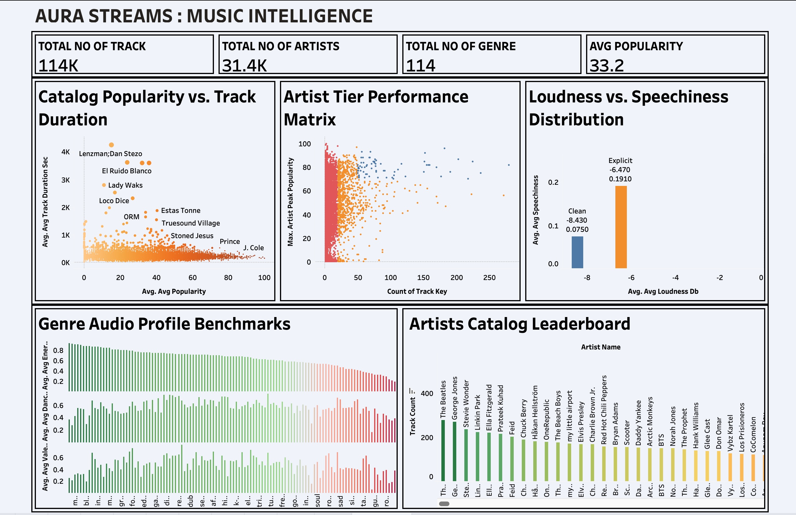

# 🎵 Aura Streams: Music Intelligence & Analytics Platform

An enterprise-grade modern data stack platform built for **Aura Streams** using **Snowflake (Medallion Architecture)** and visualized via an **Executive Music Intelligence Dashboard Suite**. This project processes a large multi-attribute audio and catalog database, transforming raw streaming and track logs into clean analytical models tracking **114K tracks, 31.4K artists, and 114 genres**[cite: 9].

---

## 🏗️ Architecture & Data Flow
The data pipeline follows the industry-standard **Medallion Architecture** pattern inside Snowflake, managed through a cost-controlled development warehouse (`AURA_DEV_WH`):

* **Bronze Layer (`RAW_SCHEMA`):** Raw track ingestion via an internal CSV stage (`SPOTIFY_RAW_STAGE`) with fault-tolerant error handling (`ON_ERROR = 'CONTINUE'`).
* **Silver Layer (`SILVER_SCHEMA`):** Data cleaning, string trimming (`TRIM`, `NULLIF`), type casting (`TRY_CAST`), duration conversion, and boolean explicit-content handling.
* **Gold Layer (`GOLD_SCHEMA`):** Dimensional modeling (Star Schema) consisting of conformed dimensions (`DIM_ARTISTS`, `DIM_GENRES`, `DIM_TRACKS`) and a granular fact table (`FACT_TRACK_METRICS`) utilizing surrogate keys.
* **Analytical Serving Layer (`ANALYTICS_SCHEMA`):** Advanced SQL views pre-calculating metrics and leveraging window analytics (`OVER (PARTITION BY ...)`) for content intelligence, catalog benchmarking, and recommendation engine monitoring.

---

## 📊 Executive Dashboard Preview
The analytical views power a multi-faceted executive intelligence suite covering core media and audio metrics:

* **Music Intelligence Dashboard:** Evaluates platform-wide catalog scale (**114K Tracks**, **31.4K Artists**, **114 Genres**, **33.2 Avg Popularity**)[cite: 9], maps catalog popularity against track duration, segments artist tier performance, and analyzes acoustic profiles like loudness versus speechiness[cite: 9].
  

---

## 🛠️ Technical Highlights & Engineering Practices
* **Cost-Optimized Infrastructure:** Configured a custom Snowflake warehouse (`AURA_DEV_WH`) utilizing an `XSMALL` size, 5-minute auto-suspend, and an economy scaling policy.
* **Defensive Pipeline Engineering:** Implemented fault-tolerant bulk copying (`COPY INTO`) with robust null-value parsing and fallback defaults (`COALESCE`) for missing track titles and unassigned categories.
* **Advanced Window Analytics:** Utilized window functions (`COUNT`, `AVG`, `MAX` over partitions) directly within production views to pre-calculate artist benchmarks and genre audio profiles for high-performance dashboard rendering.

---

## 📂 Repository Structure
```text
aura-streams-music-analytics/
│
├── ASSETS/                          # Dashboard screenshots
│   └── SPOTIFY_DASHBOARD.jpeg
│
├── sql/                             # Modular SQL scripts
│   ├── WAREHOUSE_AND_DATABASE.sql
│   ├── BRONZE_STAGING.sql
│   ├── SILVER_TRANSFORMATIONS.sql
│   ├── GOLD_STAR_SCHEMA.sql
│   └── ANALYTICS_SERVING_VIEWS.sql
│
└── README.md
